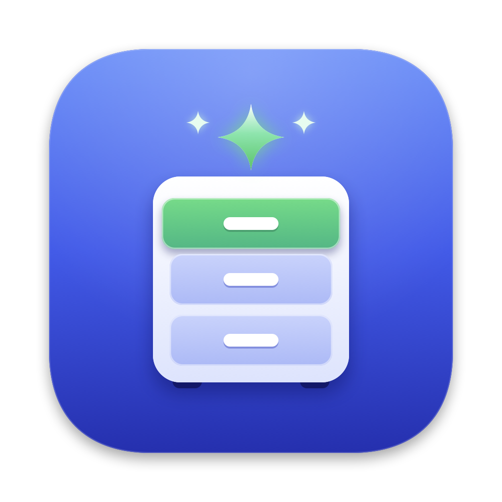
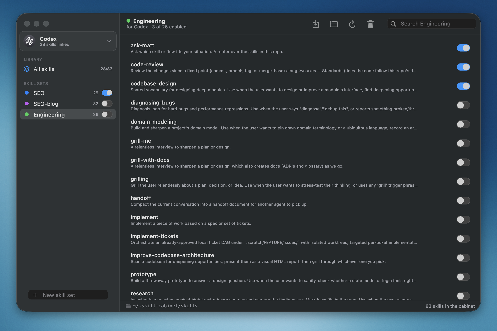
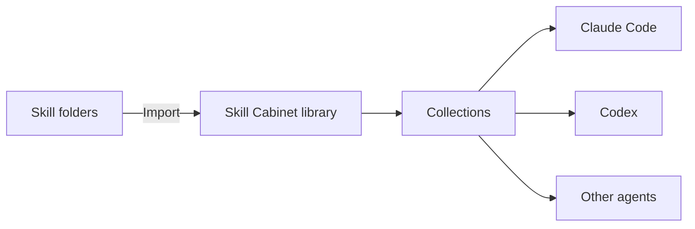

# Skill Cabinet

<p align="center">
  
</p>

**Skill Cabinet is a macOS app for organizing and sharing the skills used by your AI coding agents.**

If you use Claude Code, Codex, or another skill-based agent, Skill Cabinet gives you one place to keep your skills, group them into collections, and decide which agents should use them.



*Browse your skill library, organize skills into sets, and enable them for an agent with simple toggles.*

## Why use it?

AI agent skills are often scattered across several hidden folders. Skill Cabinet makes them visible and manageable:

- Keep all your skills in one library.
- Import existing skill folders that contain a `SKILL.md` file, or select skills from an HTTPS/SSH Git repository.
- Group related skills into collections such as *Writing*, *Research*, or *Development*.
- Turn collections or individual skills on and off for each agent.
- Keep agent skill folders synchronized with links managed by the cabinet.
- Track Git-imported skills and see when a remote revision is available.
- See problems, such as missing or conflicting skills, without silently changing files you do not own.

## How it works



The cabinet stores the original skill folders in `~/.skill-cabinet` and links enabled skills into each agent's skill directory. Your existing folders are left alone unless you explicitly import them.

## Getting started on macOS

1. Download or build **Skill Cabinet**.
2. Open the app.
3. Add the agents you use from **Manage agents**.
4. Choose **Import Skill Folder…** and select a folder containing `SKILL.md`.
5. Create a collection, add skills to it, and enable that collection for an agent.

Skill Cabinet is currently a macOS desktop app. It does not require an account or a cloud service; your library stays on your Mac.

## Build from source

This project is built with Flutter and uses [FVM](https://fvm.app) to pin the Flutter version.

```sh
fvm flutter pub get
fvm flutter run -d macos
```

To create a release app:

```sh
fvm flutter build macos --release
```

The resulting app is at `build/macos/Build/Products/Release/Skill Cabinet.app`.

Run the test suite with:

```sh
fvm flutter test
```

## Data and privacy

Skill Cabinet stores its data locally:

```text
~/.skill-cabinet/skills/          imported skills
~/.skill-cabinet/collections.json collections and membership
~/.skill-cabinet/deployment.json  agents and assignments
~/.skill-cabinet/git_sources.json tracked Git repository sources
```

The app does not upload your skills. It uses macOS file links to make enabled skills available to your agents.

## Status

Skill Cabinet is an early macOS release. Git repository import supports shallow HTTPS/SSH checkouts, with provider-neutral remote revision checks and cloud status indicators. Applying an available update remains an explicit user action.

## License

Do What The Fuck You Want To Public License (WTFPL). See [LICENSE](LICENSE).
