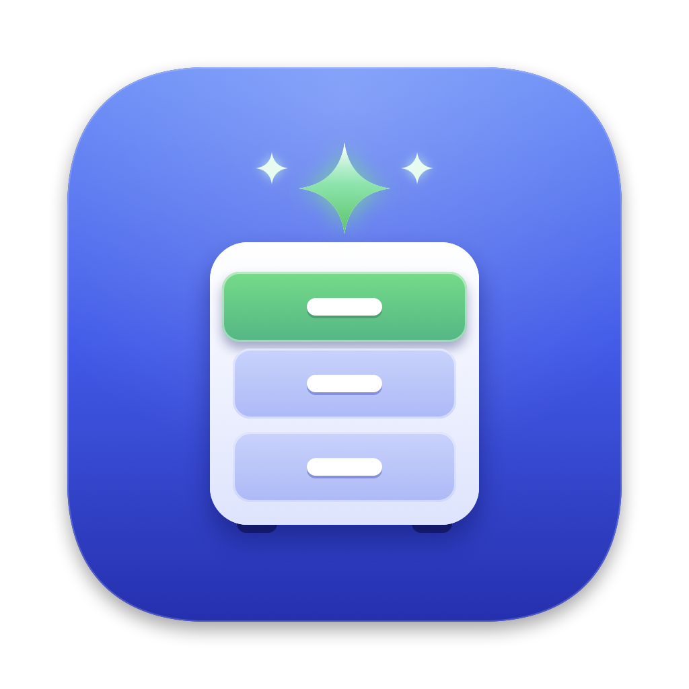
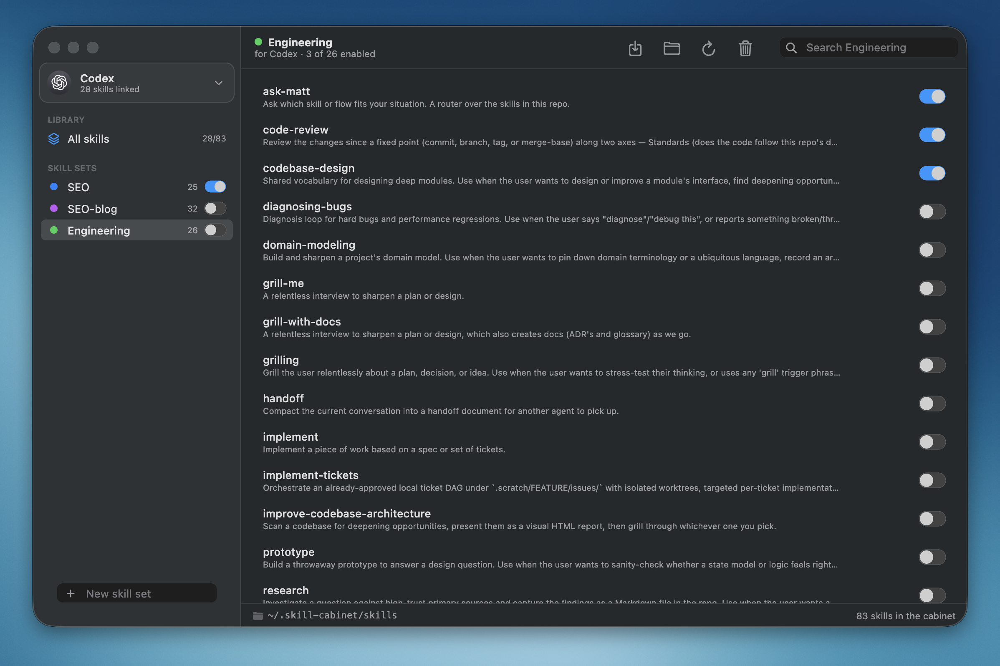

# Skill Cabinet

<p align="center">
  
</p>

**Skill Cabinet is a macOS app for organizing and sharing the skills used by your AI coding agents.**

If you use Claude Code, Codex, or another skill-based agent, Skill Cabinet gives you one place to keep your skills, group them into collections, and decide which agents should use them.



*Browse your skill library, organize skills into sets, and enable them for an agent with simple toggles.*

## Why use it?

AI agent skills are often scattered across several hidden folders. Skill Cabinet makes them visible and manageable:

- Keep all your skills in one library.
- Import existing skill folders that contain a `SKILL.md` file, or select skills from an HTTPS/SSH Git repository.
- Group related skills into collections such as *Writing*, *Research*, or *Development*.
- Turn collections or individual skills on and off for each agent.
- Keep agent skill folders synchronized with links managed by the cabinet.
- Track Git-imported skills, review file changes against your local copy, and update selected skills in place.
- Discover new skills in tracked repositories, then import or dismiss them from the update manager.
- See problems, such as missing or conflicting skills, without silently changing files you do not own.
- Back up the whole cabinet automatically to a Git history, optionally pushed to a repository you own, and restore it on a new Mac.

## How it works

The cabinet stores the original skill folders in `~/.skill-cabinet` and links enabled skills into each agent's skill directory. Your existing folders are left alone unless you explicitly import them.

## Getting started on macOS

1. Download the macOS DMG from [GitHub Releases](https://github.com/qwadrox/skill-cabinet/releases), or build **Skill Cabinet** from source. The release download supports Apple Silicon and Intel Macs.
2. Open the DMG and drag **Skill Cabinet.app** onto the **Applications** shortcut. Eject the disk image, then open the app from Applications. Releases are not signed with an Apple Developer ID or notarized. If macOS blocks the app, try opening it once, then go to **System Settings → Privacy & Security → Open Anyway**.
3. Add the agents you use from **Manage agents**.
4. Choose **Import Skill Folder…** and select a folder containing `SKILL.md`.
5. Create a collection, add skills to it, and enable that collection for an agent.

Skill Cabinet is currently a macOS desktop app. It does not require an account or a cloud service; your library stays on your Mac unless you connect a backup repository.

## App updates

Skill Cabinet checks for new app versions in the background and shows a native macOS update window when one is available. You can also choose **Skill Cabinet → Check for App Updates…** or use the same action in the ⋯ toolbar menu. Downloading and installing an update requires your action; choose **Install and Relaunch** to replace the app and restart it. Your library in `~/.skill-cabinet` is kept.

Updates are downloaded from GitHub Releases and verified using [Sparkle](https://sparkle-project.org/)'s Ed25519 signatures before extraction. Install the app in Applications first; an app running directly from a read-only DMG cannot update itself. Existing versions without Sparkle need one manual installation of a version that includes the updater.

## Backup

Everything in `~/.skill-cabinet` is backed up automatically: your skills, collections, agents and their assignments, and where Git-imported skills came from.

- **Local history.** The cabinet folder is a Git repository. A backup point is made about 20 seconds after each change, and only if something actually changed. Open **Backup…** (File menu or the ⋯ toolbar menu) to see the history and restore any earlier point. A restore is added as a new backup point, so it can be undone too.
- **Remote copy (optional).** In **Backup…**, connect an empty private repository, for example `git@github.com:you/skill-cabinet-backup.git`. Every backup point is then pushed there. Git signs in with your existing SSH key or saved credentials; the app stores no tokens.
- **Moving to a new Mac.** Install the app, open **Backup…**, and connect the same repository. Skill Cabinet recognizes the backup and offers to restore it, then recreates each agent's skill folder and links. Agent folders under your home folder are stored as `~/...`, so they resolve even if your user name differs.

The remote is a copy of one Mac, not a sync service. Skill Cabinet never merges or force-pushes. If the repository has changes this Mac does not have, the push stops and the Backup window explains why. Before replacing a cabinet from a remote, the previous state is kept on the local `before-restore` branch.

## Build from source

This project is built with Flutter and uses [FVM](https://fvm.app) to pin the Flutter version.

```sh
fvm flutter pub get
fvm flutter run -d macos
```

To create a release app:

```sh
fvm flutter build macos --release
```

The resulting app is at `build/macos/Build/Products/Release/Skill Cabinet.app`.

Run the test suite with:

```sh
fvm flutter test
```

## Publishing a release

The [macOS release workflow](.github/workflows/release-macos.yml) runs when a version tag such as `v1.0.0` is pushed. It installs the Flutter version from `.fvmrc`, runs the tests, builds a universal macOS app, and publishes a DMG with generated release notes and a signed `appcast.xml` in GitHub Releases. The DMG includes a compact branded window with the app and an Applications shortcut. Its background and Finder layout are defined in `tool/dmg/`.

The updater uses `https://github.com/qwadrox/skill-cabinet/releases/latest/download/appcast.xml` as its stable feed URL. The workflow prepares a draft release, generates the appcast with embedded release notes, uploads the DMG and appcast, then publishes the complete release. No separate update server or GitHub Pages setup is needed. Every release designated as latest must include `appcast.xml`.

The `SPARKLE_PRIVATE_KEY` repository secret is required. Its matching public key is embedded in `macos/Runner/Info.plist`. The private key is also stored locally in the login Keychain under Sparkle's `skill-cabinet` account. Keep a secure backup of this key: replacing the public key alone prevents installed copies from trusting new updates. The private key must never be committed. To transfer the existing key to GitHub Actions without printing it:

```sh
# Use the tools from the Sparkle 2.9.6 distribution.
# The exported file is sensitive; use a private temporary directory and delete it.
key_directory=$(mktemp -d)
chmod 700 "$key_directory"
./bin/generate_keys --account skill-cabinet -x "$key_directory/key"
gh secret set SPARKLE_PRIVATE_KEY --repo qwadrox/skill-cabinet < "$key_directory/key"
rm -rf "$key_directory"
```

Sparkle's archive signature is separate from Apple Developer ID signing and notarization. The workflow still does not require an Apple account; the existing macOS Gatekeeper instructions continue to apply. Sparkle is pinned to 2.9.6 in the Xcode project and in the workflow; update both together when upgrading it. This patched version preserves support for older macOS versions; Sparkle 2.10 raises the minimum to macOS 12.

After committing and pushing the changes you want to release:

```sh
git tag v1.0.0
git push origin v1.0.0
```

Use a new `vMAJOR.MINOR.PATCH` tag for each release. The tag sets the app version, overriding `pubspec.yaml` for that build. Monitor the run in the repository's **Actions** tab; the download appears in **Releases** after the tests and build succeed. A rerun of the same tag replaces its existing DMG.

## Data and privacy

Skill Cabinet stores its data locally:

```text
~/.skill-cabinet/skills/          imported skills
~/.skill-cabinet/collections.json collections and membership
~/.skill-cabinet/deployment.json  agents and assignments
~/.skill-cabinet/git_sources.json tracked Git repository sources
~/.skill-cabinet/git_repositories.json seen skills and pending discoveries per repository/branch
~/.skill-cabinet/.git/            backup history
```

The app uploads nothing unless you connect a backup repository; then it pushes the cabinet only there. It uses macOS file links to make enabled skills available to your agents.

## Status

Skill Cabinet is an early macOS release. Git repository import supports shallow HTTPS/SSH checkouts, with provider-neutral remote revision checks, cloud status indicators, and an update manager. Applying an available update remains an explicit user action.

The update manager also lists newly discovered skills in tracked repositories. The first import remembers all skills found, including ones you skip. New discoveries remain available across checks and restarts until you import or dismiss them; importing does not enable them for any agent. Repositories imported before discovery was supported establish their initial list on the next check without flagging existing skills as new.

## License

Do What The Fuck You Want To Public License (WTFPL). See [LICENSE](LICENSE).
